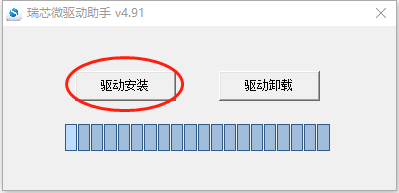
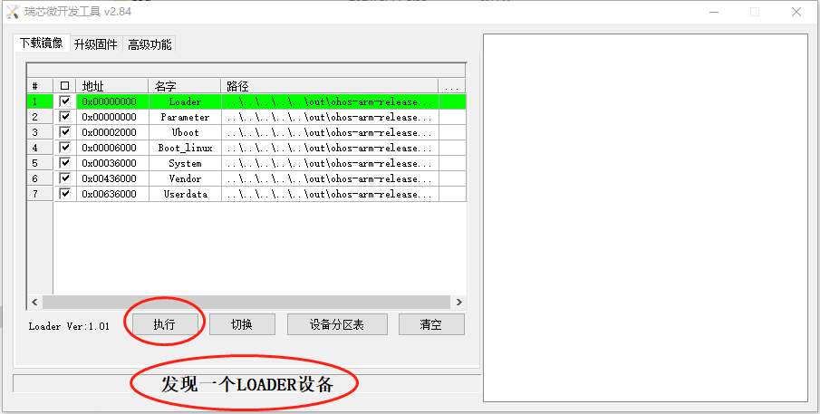

# 烧写准备

## 进入烧写模式

1. USB线连接USB3.0 OTG接口(开发板正面的TYPE-A接口或者背面的MicroUSB接口）

2. 按住底板上的Recovery按键后重启系统，大约1秒后松开Recovery按键， 系统将进入"Loader模式"。

   或者：

   按住核心板上的Maskrom按键（位于EMMC的旁边）后重启系统，系统将进入"Maskrom模式"。

# Windows主机烧写固件

## 安装USB驱动

双机*windows\DriverAssitant\ DriverInstall.exe*打开安装程序，点击下图所示的“驱动安装”按钮，按提示安装USB驱动：



*说明：如果已经安装旧版本的烧写工具，请先点击"驱动卸载"按钮下载驱动，然后再点击"驱动安装"按钮安装驱动*。

## 打开烧写工具

双机*windows\RKDevTool.exe*打开烧写工具，工具界面如下图所示：



## 查看开发板是否进入烧写模式

1. 如果界面显示"发现一个LOADER设备", 说明开发板进入Loader模式等待烧写固件。

2. 如果界面显示"发现一个MASKROM设备", 说明开发板进入Maskrom模式等待烧写固件。

3. 如果界面显示"没有发现设备"，说明开发板没有进入烧写模式，请按文档第一章节操作让开发板进入烧写模式。

   ***说明：Toybrick开发板都是GPT分区。如果之前有烧写过旧的MBR分区的固件，需要进入Maskrom模式才能修改为GPT分区格式。***

## 烧写固件

1. 将下载的固件保存到*out/ohos-arm-release/packages/phone/images*目录下。

2. 勾选需要烧写的固件，点击烧写工具的"执行"按钮，开始烧写固件。

   *说明：*
   
    *如果烧写成功，在工具界面右侧会显示烧写成功*
   
   *如果烧写失败，在工具界面右侧会用红色的字体显示烧写错误信息，更多出错信息查看：Log目录下的文件*


# Linux命令行烧写固件

## 查看开发板是否进入烧写模式

进入OHOS的根目录，执行如下命令查看：

```
python3 flash.py -q
```

*说明：*

1. *如果输出"loader", 说明开发板进入Loader模式等待烧写固件*
2. *如果输出"maskrom", 说明开发板进入Maskrom模式等待烧写固件*
3. *如果输出"none"，说明开发板没有进入烧写模式，请按文档第一章节操作让开发板进入烧写模式*

## 烧写固件

执行如下命令烧写固件：

1. 烧写所有固件：

```
python3 flash.py -a
```

​      *说明：此命令会烧写所有OHOS固件，包括：uboot, kernel(boot_linux), system, vendor, userdata固件*

2. 烧写指定固件：

```
python3 flash.py -u     //烧写uboot.img
python3 flash.py -k     //烧写boot_linux.img
python3 flash.py -s     //烧写system.img
python3 flash.py -v     //烧写vendor.img
python3 flash.py -d     //烧写userdata.img
```

*说明：烧写多个指定固件，可以根据需要执行输入多个参数。如：-sv表示烧写system.img和vendor.img*